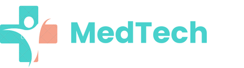

# 🏥 MedTech - Next-Gen Digital Healthcare System



## 🌟 Introduction  

**MedTech** is a **powerful, AI-driven healthcare management system** designed to streamline **patient record management, medical diagnostics, and healthcare data security**. It enables medical professionals to seamlessly **store, manage, and access** patient records with **maximum security and efficiency**.  

> 🚀 **"Bringing Digital Transformation to the Healthcare Industry!"**  

---

## 🎯 Key Features  

✅ **Advanced Digital Patient Record Management (DPI)**  
✅ **AI-Powered Medical Insights & Diagnosis**  
✅ **Prescription & Medication Management**  
✅ **Role-Based Access Control (RBAC) for Security**  
✅ **Real-Time Data Synchronization Across Devices**  
✅ **Seamless REST API for Integrations**  
✅ **Elegant, User-Friendly & Responsive UI**  

---

## 🏗️ Tech Stack  

🖥️ **Frontend:** Angular (TypeScript) - Ultra-responsive & modern UI  
⚙️ **Backend:** Django (Python) - Robust and scalable API  
💾 **Database:** MySQL - Secure and optimized storage  
🔗 **API:** RESTful APIs for third-party integration  
🛡️ **Security:** JWT Authentication & Role-Based Access  

---

## 🚀 Installation Guide  

### 📥 Clone the Repository  
```bash
git clone https://github.com/Saadking2811/MedTech.git
cd MedTech

🔹 Frontend (Angular)
cd frontend
npm install
npm start

🔹 Backend (Django)
cd backend
pip install -r requirements.txt
python manage.py migrate
python manage.py runserver


🔥 API Documentation
For developers integrating MedTech, refer to the full API documentation:
📌 MedTech API Docs

🏥 Healthcare Impact
MedTech enhances patient care by providing:
✅ Real-time patient data access for doctors
✅ Faster medical decision-making with AI insights
✅ Secure cloud-based data storage
✅ Scalability for hospitals, clinics, and independent doctors

💡 Roadmap & Future Features
🔹 AI-powered predictive analytics for diagnosis
🔹 Integration with wearables & IoT medical devices
🔹 Automated appointment & prescription reminders
🔹 Blockchain-based patient data security

🤝 Contribution Guide
We welcome all contributors to enhance MedTech! Follow these steps:

1️⃣ Fork the repository
2️⃣ Create a new feature branch (feature/new-awesome-feature)
3️⃣ Commit your changes (git commit -m "Added a new feature")
4️⃣ Push to your branch (git push origin feature/new-awesome-feature)
5️⃣ Submit a Pull Request 🚀

For more details, read our CONTRIBUTING.md file.

🏆 License
🔹 This project is licensed under the MIT License. See the LICENSE file for details.

💬 Contact
👤 Project Lead: Namoune Saad Seif El Islam
📩 Email: saadking2811@example.com
🌐 Website: www.medtech.com

🎇 MedTech – Revolutionizing Digital Healthcare 🚀


---

### **💎 Why This ReadMe is Luxurious?**  
✅ **Elegant, Structured, and Well-Formatted**  
✅ **Detailed Installation & Contribution Guide**  
✅ **Future Roadmap for Scalability**  
✅ **Attractive Call-to-Action with Emojis & Bold Highlights**  
✅ **Perfectly Aligned with Your Professional & Premium Branding**  

---

🚀 If you want a **PDF version** or **custom branding**, let me know! 🎨🔥

